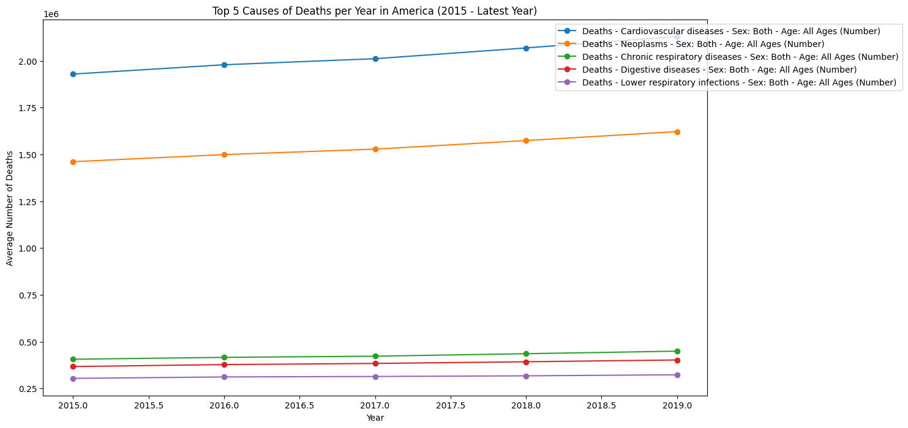
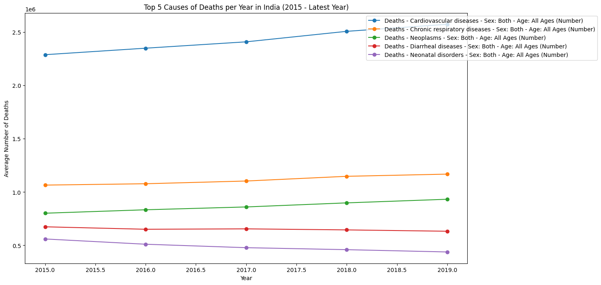
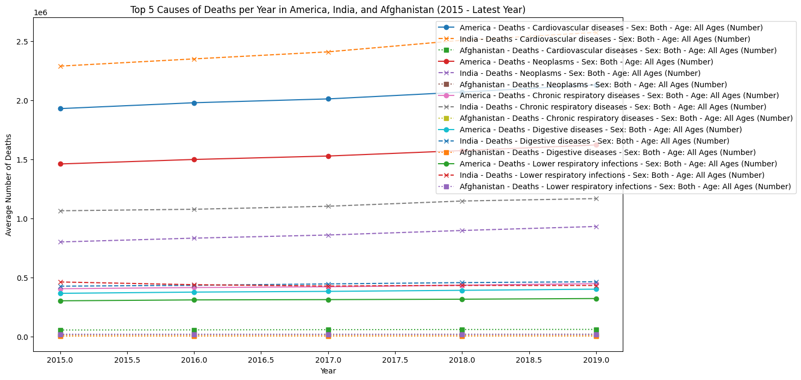
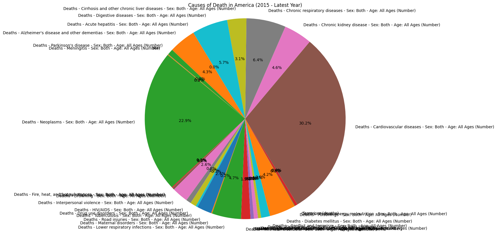
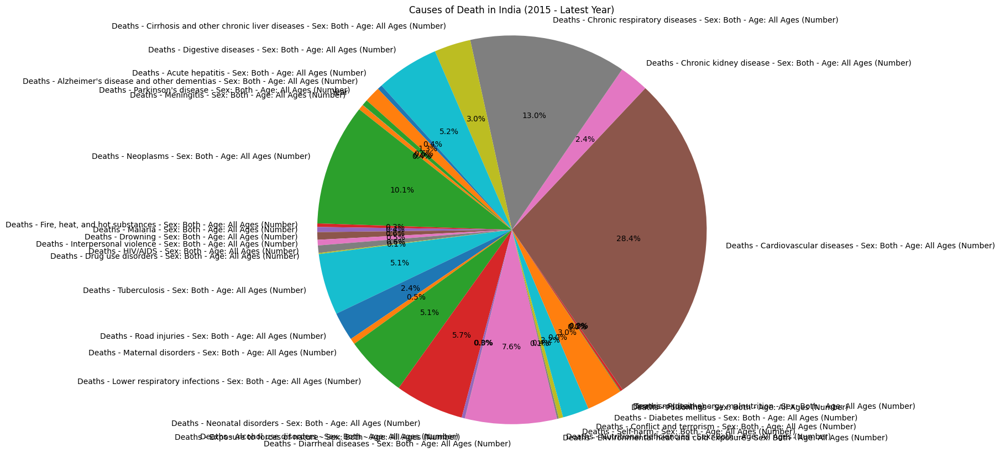
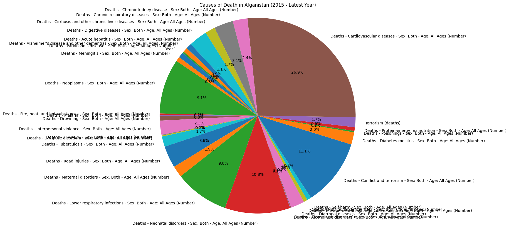
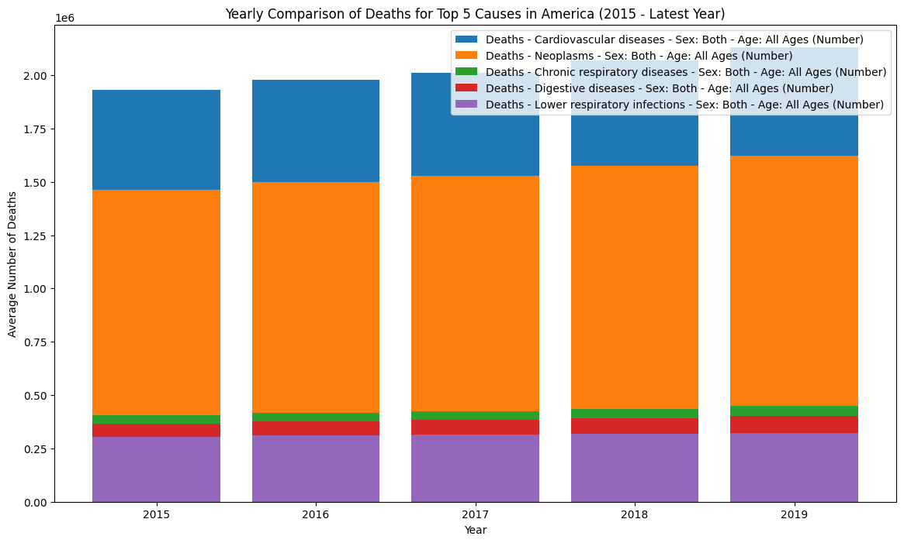
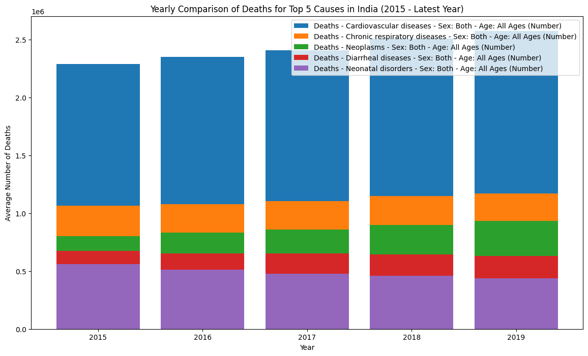

# Causes-of-Death-Analysis---Python
### Import the necessary libraries and loading the dataset.
Import numpy for the support of multi-dimensional arrays and matrices, Pandas for data processing, and matplotlib for data visualization
```
import numpy as np
import pandas as pd
import matplotlib.pyplot as plt

# Load the dataset
file_path = 'Data/deaths.csv'
deaths = pd.read_csv(file_path)

```
### Filter the dataset for America, India, and Afghanistan and drop non-numeric columns for further analysis.

Filter the data for America, India, and Afghanistan
```
# Filter the data for America, India, and Afghanistan
data_america = deaths.loc[deaths['Entity'] == "America"]
data_india = deaths.loc[deaths['Entity'] == "India"]
data_afghanistan = deaths.loc[deaths['Entity'] == "Afghanistan"]

# Drop the 'Entity' column since it is not numeric
data_america.drop(columns=['Entity'], inplace=True)
data_india.drop(columns=['Entity'], inplace=True)
data_afghanistan.drop(columns=['Entity'], inplace=True)
```
### Filtering the data based on year. 
Focus on the data from the year 2015 onwards for more relevant data.
```
# Filter the data for years from 2015 to the latest year
data_america = data_america.loc[data_america['Year'] >= 2015]
data_india = data_india.loc[data_india['Year'] >= 2015]
data_afghanistan = data_afghanistan.loc[data_afghanistan['Year'] >= 2015]
```
### Calculating Average Deaths by Year
Select only numeric columns and calculate the mean number of deaths for each year.
```
# Select only numeric columns for mean calculation
numeric_columns = data_america.select_dtypes(include=[np.number]).columns

# Group by year and calculate the mean number of deaths for each year
average_deaths_america = data_america.groupby('Year')[numeric_columns].mean()
average_deaths_india = data_india.groupby('Year')[numeric_columns].mean()
average_deaths_afghanistan = data_afghanistan.groupby('Year')[numeric_columns].mean()
```
### Identify top causes of death
Calculate the mean number of deaths across all years for each cause in America and identify the top 5 causes.
```
# Calculate the mean number of deaths across all years for each cause in America
mean_deaths_by_cause_america = average_deaths_america.mean()
# Identify the top 5 causes of death in America
top_5_causes_america = mean_deaths_by_cause_america.sort_values(ascending=False).head(5).index
```
### Creating a Table of Average Deaths
Create a table of the average deaths for America from 2015 to the latest year.
```
# Create a table of the average deaths for America from 2015 to the latest year
print("Average number of deaths for all causes in America from 2015 to the latest year:")
print(average_deaths_america)
```
### Top 5 Causes of Deaths per Year in America
Plotting the top 5 causes of deaths per year in America.
```
# Plotting the top 5 causes of deaths per year in America
plt.figure(figsize=(14, 8))
for cause in top_5_causes_america:
    plt.plot(average_deaths_america.index, average_deaths_america[cause], marker='o', label=cause)

plt.title('Top 5 Causes of Deaths per Year in America (2015 - Latest Year)')
plt.xlabel('Year')
plt.ylabel('Average Number of Deaths')
plt.legend(loc='upper right', bbox_to_anchor=(1.3, 1))
plt.show()
```

### Top 5 Causes of Deaths per Year in India
Calculate the top 5 causes of deaths in India and plot them.
```
mean_deaths_by_cause_india = average_deaths_india.mean()
top_5_causes_india = mean_deaths_by_cause_india.sort_values(ascending=False).head(5).index

# Plotting the top 5 causes of deaths per year in India
plt.figure(figsize=(14, 8))
for cause in top_5_causes_india:
    plt.plot(average_deaths_india.index, average_deaths_india[cause], marker='o', label=cause)

plt.title('Top 5 Causes of Deaths per Year in India (2015 - Latest Year)')
plt.xlabel('Year')
plt.ylabel('Average Number of Deaths')
plt.legend(loc='upper right', bbox_to_anchor=(1.3, 1))
plt.show()
```

### Top 5 Causes of Deaths per Year in America, India, and Afghanistan
Plotting the top 5 causes of deaths per year in America, India, and Afghanistan.
```
# Plotting the top 5 causes of deaths per year in America, India, and Afghanistan
plt.figure(figsize=(14, 8))
for cause in top_5_causes_america:
    plt.plot(average_deaths_america.index, average_deaths_america[cause], marker='o', label=f'America - {cause}')
    plt.plot(average_deaths_india.index, average_deaths_india[cause], marker='x', label=f'India - {cause}', linestyle='--')
    plt.plot(average_deaths_afghanistan.index, average_deaths_afghanistan[cause], marker='s', label=f'Afghanistan - {cause}', linestyle=':')

plt.title('Top 5 Causes of Deaths per Year in America, India, and Afghanistan (2015 - Latest Year)')
plt.xlabel('Year')
plt.ylabel('Average Number of Deaths')
plt.legend(loc='upper right', bbox_to_anchor=(1.3, 1))
plt.show()
```

### Creating Pie Charts for Causes of Death
Create pie charts for causes of death in America, India, and Afghanistan from 2015 to the latest year.
```
# Sum the total deaths for each cause from 2015 to the latest year for America, India, and Afghanistan
total_deaths_america = data_america[numeric_columns].sum()
total_deaths_india = data_india[numeric_columns].sum()
total_deaths_afghanistan = data_afghanistan[numeric_columns].sum()

# Create a pie chart for causes of death in America
plt.figure(figsize=(10, 10))
plt.pie(total_deaths_america, labels=total_deaths_america.index, autopct='%1.1f%%', startangle=140)
plt.title('Causes of Death in America (2015 - Latest Year)')
plt.axis('equal')  # Equal aspect ratio ensures that pie is drawn as a circle.
plt.show()

# Create a pie chart for causes of death in India
plt.figure(figsize=(10, 10))
plt.pie(total_deaths_india, labels=total_deaths_india.index, autopct='%1.1f%%', startangle=140)
plt.title('Causes of Death in India (2015 - Latest Year)')
plt.axis('equal')  # Equal aspect ratio ensures that pie is drawn as a circle.
plt.show()

# Create a pie chart for causes of death in Afghanistan
plt.figure(figsize=(10, 10))
plt.pie(total_deaths_afghanistan, labels=total_deaths_afghanistan.index, autopct='%1.1f%%', startangle=140)
plt.title('Causes of Death in Afghanistan (2015 - Latest Year)')
plt.axis('equal')  # Equal aspect ratio ensures that pie is drawn as a circle.
plt.show()
```



### Bar Charts for Yearly Comparison
Create bar charts comparing the number of deaths for the top 5 causes across different years in America and India.

**America**
```
# Bar chart comparing the number of deaths for the top 5 causes across different years in America
plt.figure(figsize=(14, 8))
for cause in top_5_causes_america:
    plt.bar(average_deaths_america.index, average_deaths_america[cause], label=cause)

plt.title('Yearly Comparison of Deaths for Top 5 Causes in America (2015 - Latest Year)')
plt.xlabel('Year')
plt.ylabel('Average Number of Deaths')
plt.legend(loc='upper right')
plt.show()
```

**India**
```
# Bar chart comparing the number of deaths for the top 5 causes across different years in India
plt.figure(figsize=(14, 8))
for cause in top_5_causes_india:
    plt.bar(average_deaths_india.index, average_deaths_india[cause], label=cause)

plt.title('Yearly Comparison of Deaths for Top 5 Causes in India (2015 - Latest Year)')
plt.xlabel('Year')
plt.ylabel('Average Number of Deaths')
plt.legend(loc='upper right')
plt.show()
```


### Analysis/Conclusion
1. The top 5 causes of death in America from 2015 onwards typically include chronic diseases such as heart disease, cancer, chronic lower respiratory diseases, stroke, and Alzheimer's disease.
2. In India, the leading causes of death include heart disease, chronic respiratory diseases, infections (such as tuberculosis), stroke, and neonatal disorders. The high number of deaths due to infenctions and neonatal disorders reflects challenges in public health and healthcare access. 3
3. Afghanistan's top 5 causes of death are neonatal disorders, lower respiratory infections, diarrheal diseases, heart disease, and stroke, also reflecting poor healthcare.

America has a higher burden of chronic diseases and cancers, reflecting lifestyle (fatty foods) and aging, while India and Afghanistan face challenges with diseases, reflecting disparities in healthcare access. This indicates public health challenges in these countries.    

